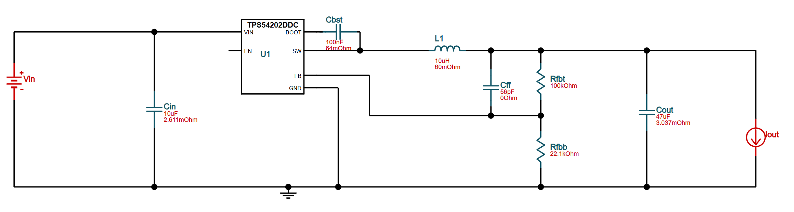

# Must have
 - Single power supply `12..24VDC`
 - One RS485 port must be galvanicly isolated
 - Onboard isolated voltage regulator `3.3VDC`
 - Auto adaptation to: 
    - baudrate `9600..115200 bps`
    - parity `none, even, odd`
    - stop bits `1, 2`
    - data bits `8, 7`
 - LED showing power supply
 - LEDs showing communication direction
 - LED showing errors in communication - both sides are beeing driven in the same time

# Components
 - [Texas Instruments ISO1410DW](https://www.tme.eu/pl/details/iso1410dw/uklady-scalone-rs232-rs422-rs485/texas-instruments/) - isolated RS485 transceiver
 - [Texas Instruments THVD1400DR](https://www.tme.eu/pl/details/thvd1400dr/uklady-scalone-rs232-rs422-rs485/texas-instruments/) - non-isolated RS485 transceiver
 - [AIMTEC AM1S-0303SH30Z](https://www.tme.eu/pl/details/am1s-0303sh30z/przetwornice-dc-dc/aimtec/) - 3.3VDC isolated voltage regulator
 - [Texas Instruments TPS54202DDCR](https://www.tme.eu/pl/details/tps54202ddcr/regulatory-napiecia-uklady-dc-dc/texas-instruments/) - 3.3VDC non-isolated voltage regulator
 - [Raspberry RP2040](https://www.tme.eu/pl/details/sc0914-7/raspberry-pi-embedded/raspberry-pi/ic-rp2040-rp2b2-t-r-500-7-reel/) - microcontroller
 - [Winbond W25Q16JVUXIQ TR](https://www.tme.eu/pl/details/w25q16jvuxiq-tr/pamieci-flash-szeregowe/winbond/w25q16jvuxiq-tr/) - flash memory
 - [Abracon ABM8-272-T3](https://mou.sr/4bnWQzx) - Crystal oscillator
 - [Ferrocore 18uH 0504](https://www.tme.eu/pl/details/dlg-0504-180/dlawiki-smd-mocy/ferrocore/)

# Schematics 

**12..24VDC to 3.3VDC**

